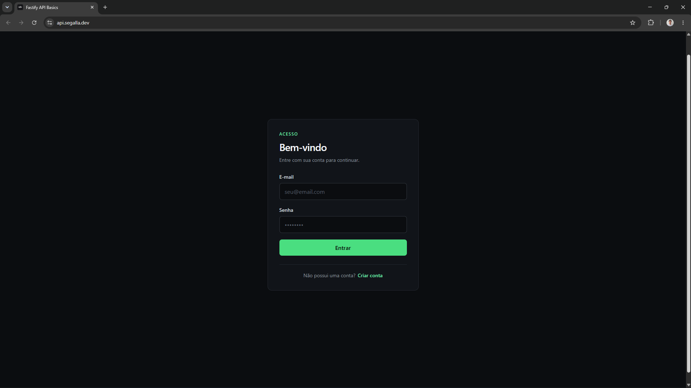
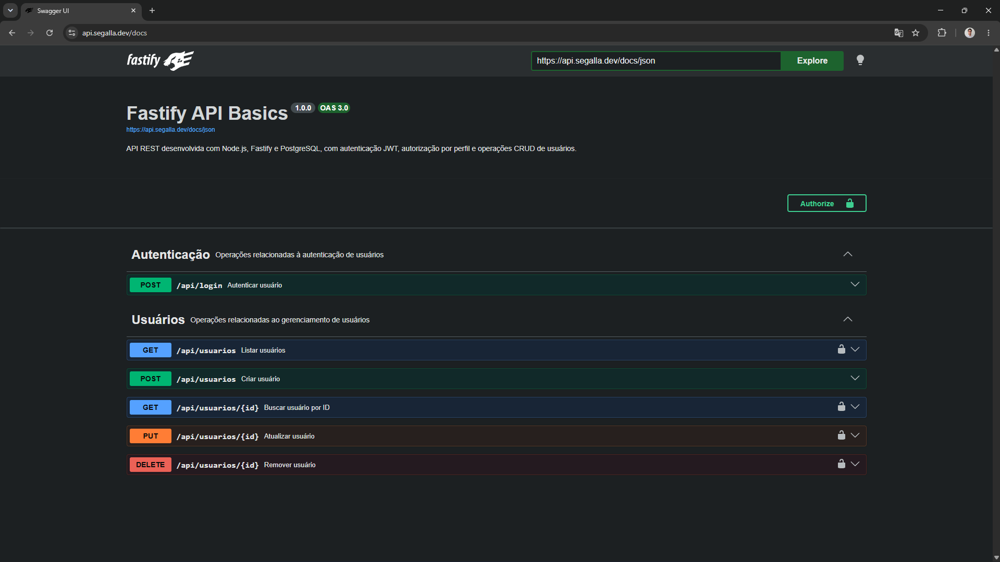

# Fastify API Basics

Aplicação web desenvolvida com Node.js, Fastify, PostgreSQL e React com foco em aprendizado e aplicação de conceitos como organização em camadas, segurança, testes, containerização, CI/CD e deploy em cloud

## Sumário

- [Objetivo](#objetivo)
- [Demonstração](#demonstração)
- [Tecnologias utilizadas](#tecnologias-utilizadas)
- [Arquitetura](#arquitetura)
- [Estrutura do projeto](#estrutura-do-projeto)
- [Funcionalidades](#funcionalidades)
- [Como executar](#como-executar)
- [Migrations](#migrations)
- [Testes automatizados](#testes-automatizados)
- [CI/CD](#cicd)
- [Deploy](#deploy)
- [Documentação da API](#documentação-da-api)
- [Endpoints](#endpoints)
- [Roadmap](#roadmap)
- [Autor](#autor)

## Objetivo

O projeto começou como uma API CRUD simples para estudar Node.js e Fastify e foi evoluindo conforme novos conceitos foram sendo adicionados, com o tempo foram implementados autenticação e autorização, testes de integração, documentação com Swagger, migrations, Docker, CI/CD, frontend e deploy em cloud utilizando Render e AWS, a ideia é utilizar o repositório como uma referência prática dos conceitos estudados durante o desenvolvimento

## Demonstração

### Frontend



### Swagger



## Tecnologias utilizadas

### Backend

- **JavaScript** - Linguagem utilizada na aplicação
- **Node.js** - Ambiente de execução JavaScript
- **Fastify** - Framework utilizado para construir a API
- **@fastify/static** - Servimento dos arquivos estáticos do frontend em produção
- **PostgreSQL** - Banco de dados relacional
- **pg** - Comunicação entre a aplicação e o PostgreSQL
- **JWT** - Autenticação baseada em tokens
- **bcrypt** - Hash e verificação de senhas
- **JSON Schema** - Validação das requisições e respostas
- **OpenAPI / Swagger** - Documentação da API
- **node:test** - Testes automatizados de integração

### Frontend

- **React** - Construção da interface da aplicação
- **Vite** - Ambiente de desenvolvimento e build do frontend
- **CSS** - Estilização da interface

### Containers e CI/CD

- **Docker** - Build e containerização da aplicação
- **Docker Compose** - Execução local da aplicação e PostgreSQL em containers
- **GitHub Actions** - Automação dos testes, build e deploys

### Cloud

- **Render** - Ambiente de deploy da API
- **Amazon ECR** - Armazenamento das imagens Docker
- **Amazon ECS + AWS Fargate** - Execução dos containers na AWS
- **Amazon RDS** - PostgreSQL gerenciado
- **Application Load Balancer** - Entrada pública e direcionamento do tráfego para a aplicação
- **AWS Certificate Manager** - Certificado SSL/TLS utilizado no HTTPS
- **AWS Systems Manager Parameter Store** - Armazenamento de secrets
- **Amazon CloudWatch** - Logs da aplicação
- **AWS IAM, STS e OIDC** - Autenticação do GitHub Actions na AWS
- **Cloudflare** - Domínio e gerenciamento de DNS

## Arquitetura

A aplicação utiliza uma arquitetura em camadas para manter cada parte do código com uma responsabilidade definida

```text
Frontend
   ↓
Fastify
   ↓
Routes
   ↓
Controllers
   ↓
Services
   ↓
Repositories
   ↓
PostgreSQL
```

### Frontend

Responsável pela interface da aplicação e pela comunicação com a API

### Fastify

Framework responsável por receber e processar as requisições HTTP e direcioná-las para as rotas definidas na aplicação

### Routes

Definem as rotas da API e conectam cada endpoint aos seus schemas, middlewares e controllers

### Controllers

Recebem as requisições HTTP, extraem os dados necessários e chamam os services responsáveis pelo processamento

### Services

Concentram as regras de negócio como normalização de dados, hash de senhas, autorização e tratamento de usuários inexistentes

### Repositories

Concentram as consultas SQL e a comunicação com o PostgreSQL

### Schemas

Definem as validações de entrada e saída utilizando JSON Schema e também são utilizados para gerar a documentação OpenAPI

## Estrutura do projeto

```text
.
├── .github/
│   └── workflows/
│       └── ci.yml        # Pipeline de CI/CD
├── backend/
│   ├── config/           # Configurações da aplicação
│   ├── controllers/      # Tratamento das requisições HTTP
│   ├── database/
│   │   ├── migrations/   # Migrations do banco de dados
│   │   ├── connection.js # Conexão com PostgreSQL
│   │   └── migrate.js    # Executor das migrations
│   ├── errors/           # Erros personalizados
│   ├── middlewares/      # Autenticação e autorização
│   ├── repositories/     # Consultas ao banco de dados
│   ├── routes/           # Rotas da API
│   ├── schemas/          # Validação e documentação das rotas
│   ├── services/         # Regras de negócio
│   ├── tests/
│   │   ├── helpers/      # Utilitários utilizados nos testes
│   │   └── integration/  # Testes de integração
│   ├── Dockerfile        # Build do frontend e imagem da aplicação
│   ├── app.js            # Configuração e criação da aplicação Fastify
│   ├── server.js         # Inicialização do servidor
│   ├── package.json
│   └── package-lock.json
├── frontend/
│   ├── public/
│   ├── src/
│   │   ├── components/   # Componentes da interface
│   │   ├── services/     # Comunicação com a API
│   │   └── utils/        # Funções auxiliares
│   ├── index.html
│   ├── package.json
│   └── package-lock.json
├── .dockerignore         # Arquivos ignorados durante o build Docker
├── .gitignore            # Arquivos ignorados pelo Git
├── docker-compose.yml    # Aplicação e PostgreSQL em containers
└── README.md             # Documentação do projeto
```

## Funcionalidades

### Usuários

- Criação de usuários
- Listagem paginada para administradores
- Busca por ID
- Atualização de dados
- Remoção de usuários
- Normalização do nome antes da persistência
- Senhas armazenadas utilizando hash com bcrypt
- Validação de e-mail duplicado

### Autenticação e autorização

O login é realizado com e-mail e senha e retorna um token JWT com validade de uma hora

As rotas protegidas utilizam o token para identificar o usuário autenticado

Usuários comuns podem consultar, atualizar e remover a própria conta enquanto usuários com role `admin` podem realizar essas operações sobre qualquer usuário

A listagem completa de usuários é permitida apenas para administradores

### Validação e erros

As entradas da API são validadas utilizando JSON Schema

O tratamento de erros é centralizado para manter respostas consistentes em casos como `400`, `401`, `403`, `404`, `409` e `500`

### Paginação

A listagem de usuários aceita os parâmetros `page` e `limit`

Quando não informados são utilizados os valores:

```text
page=1
limit=10
```

O limite máximo por página é `100`

### Frontend

O frontend permite realizar cadastro e login, visualizar e editar o próprio perfil e remover a própria conta

Usuários administradores também possuem uma tela para listar, editar e remover outros usuários

## Como executar

A aplicação pode ser executada utilizando Docker ou diretamente no ambiente local, durante o desenvolvimento o frontend também pode ser executado separadamente utilizando Vite

### Docker

#### 1. Clonar o repositório

```bash
git clone https://github.com/lucassegalla/fastify-api-basics.git
```

#### 2. Configurar as variáveis de ambiente

Crie um arquivo `.env` dentro da pasta `backend`:

```env
PORT=3000

DB_HOST=localhost
DB_PORT=5432
DB_NAME=fastify_api
DB_USER=postgres
DB_PASSWORD=sua_senha

CORS_ORIGIN=http://localhost:5173

DB_SSL=false

JWT_SECRET=sua_chave_secreta
```

#### 3. Iniciar a aplicação

Na raiz do projeto execute:

```bash
docker compose --env-file ./backend/.env up --build
```

O Docker Compose inicia o PostgreSQL, executa as migrations pendentes e depois inicia a aplicação com frontend e backend

A aplicação ficará disponível em:

```text
http://localhost:3000
```

A documentação Swagger ficará disponível em:

```text
http://localhost:3000/docs
```

#### 4. Encerrar os containers

```bash
docker compose down
```

### Ambiente local

Para executar sem Docker é necessário ter Node.js e PostgreSQL instalados no ambiente

#### Backend

Entre na pasta do backend:

```bash
cd backend
```

Instale as dependências:

```bash
npm ci
```

Crie um arquivo `.env` dentro da pasta `backend`:

```env
PORT=3000

DB_HOST=localhost
DB_PORT=5432
DB_NAME=fastify_api
DB_USER=postgres
DB_PASSWORD=sua_senha

CORS_ORIGIN=http://localhost:5173

DB_SSL=false

JWT_SECRET=sua_chave_secreta
```

Execute as migrations:

```bash
npm run migrate
```

Inicie a API:

```bash
npm start
```

#### Frontend

Em outro terminal entre na pasta do frontend:

```bash
cd frontend
```

Instale as dependências:

```bash
npm ci
```

Crie um arquivo `.env` dentro da pasta `frontend`:

```env
VITE_API_URL=http://localhost:3000/api
```

Inicie o frontend:

```bash
npm run dev
```

O frontend ficará disponível em:

```text
http://localhost:5173
```

A API ficará disponível em:

```text
http://localhost:3000/api
```

A documentação Swagger ficará disponível em:

```text
http://localhost:3000/docs
```

## Migrations

As alterações na estrutura do banco ficam em `backend/database/migrations/` e são executadas pelo script `backend/database/migrate.js`

Atualmente o projeto possui as migrations:

```text
001-create-usuarios.sql
002-add-usuarios-constraints.sql
```

A primeira migration cria a tabela de usuários e a segunda adiciona validações para idade e role diretamente no banco

O banco mantém uma tabela chamada `_migrations` para registrar quais migrations já foram aplicadas, dessa forma o sistema consegue identificar e executar apenas as migrations pendentes

Cada migration é executada dentro de uma transação e caso alguma etapa falhe é realizado um `ROLLBACK`, evitando que alterações incompletas sejam aplicadas ao banco

Para executar localmente, dentro da pasta `backend`:

```bash
npm run migrate
```

Para executar no banco de testes:

```bash
npm run migrate:test
```

Com Docker as migrations são executadas automaticamente antes da aplicação ser iniciada

No ambiente AWS o mesmo sistema faz parte do processo de deploy, antes de uma nova versão da aplicação ser implantada uma task temporária do ECS executa as migrations pendentes

## Testes automatizados

Os testes de integração utilizam o módulo nativo `node:test` junto com `fastify.inject()`, permitindo testar as rotas da API sem precisar iniciar um servidor HTTP separado

Atualmente o projeto possui 30 testes de integração cobrindo operações CRUD, paginação, autenticação, autorização, permissões de administrador e diferentes cenários de erro

Os testes utilizam um banco PostgreSQL separado para manter o ambiente de testes isolado do banco utilizado durante o desenvolvimento

Para executar os testes localmente crie um arquivo `.env.test` dentro da pasta `backend`:

```env
PORT=3000

DB_HOST=localhost
DB_PORT=5432
DB_NAME=fastify_api_test
DB_USER=postgres
DB_PASSWORD=sua_senha

CORS_ORIGIN=http://localhost:5173

DB_SSL=false

JWT_SECRET=sua_chave_secreta_de_teste
```

Execute as migrations do banco de testes:

```bash
npm run migrate:test
```

Depois execute:

```bash
npm test
```

## CI/CD

O projeto utiliza GitHub Actions para automatizar os testes, validações do frontend e o processo de deploy

Em pushes e pull requests para a branch `main` o workflow prepara o ambiente do backend com Node.js e PostgreSQL, executa as migrations e roda os testes de integração

O frontend também é validado através do lint e do build de produção

Quando ocorre um push para a `main` e todas as etapas passam o workflow inicia o deploy na AWS

A autenticação com a AWS é feita utilizando OIDC, permitindo que o GitHub Actions assuma uma IAM Role e receba credenciais temporárias através do AWS STS sem precisar armazenar Access Keys no repositório

Durante o deploy uma nova imagem Docker é criada e enviada para o Amazon ECR, depois uma task temporária do ECS executa as migrations pendentes antes da nova versão da aplicação ser implantada

Caso os testes, o build do frontend ou a task responsável pelas migrations falhem o processo é interrompido e a nova versão da aplicação não é implantada

## Deploy

O projeto possui ambientes publicados no Render e na AWS

### Render

A API está publicada no Render utilizando Docker e um banco PostgreSQL gerenciado pela plataforma

API:

```text
https://fastify-api-basics.onrender.com
```

Documentação:

```text
https://fastify-api-basics.onrender.com/docs
```

O deploy no Render é integrado ao repositório e ocorre após os checks configurados para o projeto serem concluídos com sucesso

### AWS

A aplicação também possui um ambiente na AWS utilizando diferentes serviços para separar as responsabilidades da infraestrutura

Aplicação:

```text
https://api.segalla.dev
```

Documentação:

```text
https://api.segalla.dev/docs
```

API:

```text
https://api.segalla.dev/api
```

A imagem Docker é armazenada no Amazon ECR e executada pelo Amazon ECS utilizando AWS Fargate, enquanto o banco PostgreSQL é executado pelo Amazon RDS

A conexão com o RDS utiliza SSL/TLS através da variável:

```env
DB_SSL=true
```

Credenciais como `DB_PASSWORD` e `JWT_SECRET` ficam armazenadas no AWS Systems Manager Parameter Store e são fornecidas às tasks durante sua inicialização

Os logs dos containers são enviados para o Amazon CloudWatch

As migrations também fazem parte do deploy, antes da atualização da aplicação uma task temporária do ECS executa `npm run migrate` e o GitHub Actions verifica se a execução foi concluída com sucesso antes de continuar

### Application Load Balancer

O acesso público à aplicação na AWS é feito através de um Application Load Balancer que funciona como ponto de entrada para as requisições

O domínio `api.segalla.dev` é gerenciado pela Cloudflare e através do DNS aponta para o Load Balancer da AWS

As conexões utilizam HTTPS na porta `443` com um certificado SSL/TLS emitido pelo AWS Certificate Manager para `api.segalla.dev`

Requisições feitas através de HTTP na porta `80` são redirecionadas automaticamente para HTTPS

O ALB encaminha as requisições para o Target Group `fastify-api-tg` que mantém as tasks do ECS disponíveis para receber o tráfego

O Target Group também realiza verificações de integridade na rota `/health` e encaminha requisições apenas para tasks consideradas saudáveis

A porta `3000` das tasks não fica exposta diretamente à internet e o Security Group do ECS permite nessa porta apenas o tráfego proveniente do Security Group do Load Balancer

## Documentação da API

A documentação da API é gerada automaticamente com OpenAPI a partir dos schemas definidos na aplicação e pode ser acessada através do Swagger UI

Localmente:

```text
http://localhost:3000/docs
```

No Render:

```text
https://fastify-api-basics.onrender.com/docs
```

Na AWS:

```text
https://api.segalla.dev/docs
```

## Endpoints

| Método   | Endpoint            | Autenticação | Status | Descrição                                   |
| :------- | :------------------ | :----------: | :----: | :------------------------------------------ |
| `GET`    | `/health`           |     Não      | `200`  | Verifica se a aplicação está em execução    |
| `POST`   | `/api/login`        |     Não      | `200`  | Autentica um usuário e retorna um token JWT |
| `POST`   | `/api/usuarios`     |     Não      | `201`  | Cria um novo usuário                        |
| `GET`    | `/api/usuarios`     | JWT + Admin  | `200`  | Lista os usuários cadastrados               |
| `GET`    | `/api/usuarios/:id` |     JWT      | `200`  | Busca os dados de um usuário                |
| `PUT`    | `/api/usuarios/:id` |     JWT      | `200`  | Atualiza os dados de um usuário             |
| `DELETE` | `/api/usuarios/:id` |     JWT      | `204`  | Remove um usuário                           |

## Roadmap

### Concluído

- [x] CRUD de usuários com PostgreSQL
- [x] Arquitetura em camadas e Repository Pattern
- [x] Validação, paginação e tratamento centralizado de erros
- [x] Autenticação e autorização com JWT e hash de senhas com bcrypt
- [x] Documentação com Swagger/OpenAPI
- [x] Testes automatizados de integração
- [x] Docker e Docker Compose
- [x] Sistema de migrations com histórico de execução
- [x] CI com GitHub Actions
- [x] Deploy contínuo no Render
- [x] Deploy na AWS com ECR, ECS, Fargate e RDS
- [x] Deploy automatizado na AWS
- [x] Application Load Balancer, domínio personalizado e HTTPS
- [x] Frontend para demonstração

## Autor

Desenvolvido por **Lucas Wallace Segalla**

- GitHub: https://github.com/lucassegalla
- LinkedIn: https://linkedin.com/in/lucassegalla
